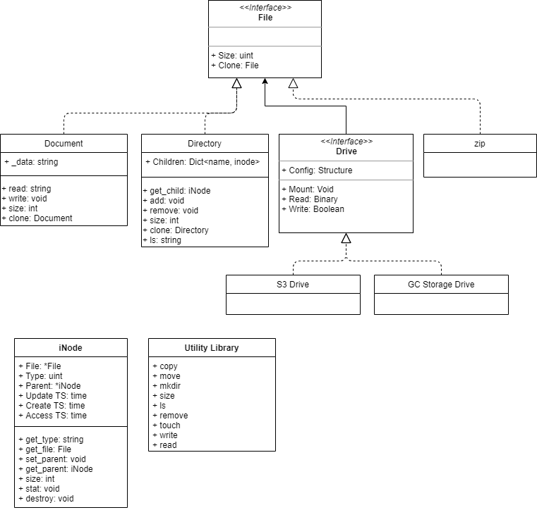
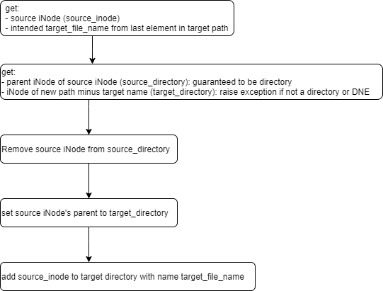

# Running the test

1. Download the repository 
```
git clone https://github.com/jcronq/ramdisk.git
```
2. Change directory to InMemoryFS
```
cd ramdisk/InMemoryFS
```
3. Run the test (python 3.6+ required.  Tested on python 3.8.2)
```
python run_test.py
```


# Design Overview

Utility functions are implemented in a library './fs/utils.py'.

iNodes are used to manage the filesystem, and Directories for names.  The unix FileSystem was used as a model for the in-memory filesystem presented here.

Root is implemented as a singleton './fs/root.py' so Root.inode() will always return the same inode.



# Move 

Move is implemented in ./fs/utils.py, but the flow is also illustrated below.



